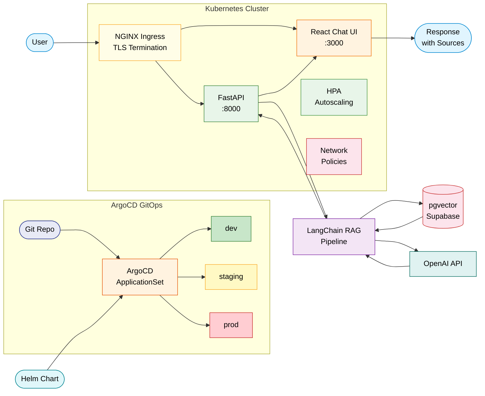

# RAG-Powered DevOps Knowledge Base

A production-ready RAG (Retrieval-Augmented Generation) chatbot that turns your DevOps documentation into an intelligent, searchable knowledge base. Ask questions in natural language and get accurate answers with source citations drawn directly from your ingested documents.

## Architecture



## Features

- **Document Ingestion** -- Upload and process PDF, DOCX, and Markdown files with automatic chunking and embedding
- **RAG Chat with Citations** -- Ask questions and receive answers grounded in your documentation, with clickable source references
- **Semantic Search** -- Find relevant documents using vector similarity powered by pgvector
- **Document Management** -- Browse, upload, and delete documents through an intuitive UI
- **Streaming Responses** -- Real-time token streaming for a responsive chat experience
- **Conversation History** -- Maintain context across multiple questions in a session
- **Kubernetes-Native Deployment** -- Production-hardened manifests with rolling updates, topology spread, liveness/readiness/startup probes, and pod security contexts
- **Helm Chart** -- Fully parameterized Helm chart with per-environment value overrides
- **ArgoCD GitOps** -- Multi-environment (dev / staging / prod) continuous delivery via ApplicationSet, with automated sync and self-healing
- **Horizontal Pod Autoscaling** -- CPU-based HPA with configurable scale-up/down behaviour
- **Network Policies** -- Default-deny ingress and egress with least-privilege allow rules per service

## Tech Stack

| Component        | Technology                         |
|------------------|------------------------------------|
| RAG Framework    | LangChain                          |
| Vector Store     | pgvector (via Supabase)            |
| Database         | Supabase (PostgreSQL)              |
| Backend API      | FastAPI + Uvicorn                  |
| Frontend         | React + TypeScript + Vite          |
| LLM              | OpenAI GPT-4o                      |
| Embeddings       | OpenAI text-embedding-3-small      |
| Orchestration    | Kubernetes                         |
| Package Manager  | Helm 3                             |
| GitOps / CD      | ArgoCD (ApplicationSet)            |
| Ingress          | NGINX Ingress Controller           |
| TLS              | cert-manager + Let's Encrypt       |
| Infrastructure   | Terraform (GCP Cloud Run)          |
| CI/CD            | GitHub Actions                     |
| Containerization | Docker + Docker Compose            |

## Quick Start

### Prerequisites

- Docker and Docker Compose
- An OpenAI API key
- A Supabase project (free tier works)

### 1. Clone and configure

```bash
git clone https://github.com/your-org/devops-knowledge-base.git
cd devops-knowledge-base
cp .env.example .env
# Edit .env with your API keys
```

### 2. Start the services

```bash
docker compose up --build
```

- **Frontend:** http://localhost:3000
- **Backend API:** http://localhost:8000
- **API Docs:** http://localhost:8000/docs

## Supabase Setup

Run the following SQL in your Supabase SQL Editor to create the required table and enable pgvector:

```sql
-- Enable the pgvector extension
create extension if not exists vector;

-- Create the documents table for storing embeddings
create table if not exists documents (
    id bigserial primary key,
    content text not null,
    metadata jsonb default '{}'::jsonb,
    embedding vector(1536)
);

-- Create an index for fast similarity search
create index on documents
    using ivfflat (embedding vector_cosine_ops)
    with (lists = 100);

-- Create the document files tracking table
create table if not exists document_files (
    id uuid primary key default gen_random_uuid(),
    filename text not null,
    file_type text not null,
    file_size bigint not null,
    chunk_count integer default 0,
    status text default 'processing',
    created_at timestamptz default now(),
    updated_at timestamptz default now()
);

-- Row-level security (optional but recommended)
alter table documents enable row level security;
alter table document_files enable row level security;

create policy "Allow all access to documents"
    on documents for all
    using (true)
    with check (true);

create policy "Allow all access to document_files"
    on document_files for all
    using (true)
    with check (true);
```

## Kubernetes Deployment

The `k8s/` directory contains production-ready, plain Kubernetes manifests that can be applied directly with `kubectl`.

### What is included

| Manifest | Purpose |
|----------|---------|
| `namespace.yaml` | Creates the `devops-kb` namespace |
| `backend/deployment.yaml` | Backend Deployment -- 2 replicas, rolling updates, security context, topology spread |
| `backend/service.yaml` | ClusterIP Service exposing port 8000 |
| `backend/configmap.yaml` | Non-sensitive configuration (model names, CORS origins, chunk settings) |
| `backend/secret.yaml` | Placeholder Secret for API keys (replace or use external-secrets in production) |
| `backend/hpa.yaml` | HorizontalPodAutoscaler -- scales 2-8 replicas on 70 % CPU with stabilisation windows |
| `frontend/deployment.yaml` | Frontend Deployment -- 2 replicas, non-root nginx |
| `frontend/service.yaml` | ClusterIP Service exposing port 80 |
| `ingress.yaml` | NGINX Ingress with TLS via cert-manager, rate limiting, and path-based routing (`/api` -> backend, `/` -> frontend) |
| `network-policy.yaml` | Default-deny ingress/egress + least-privilege allow rules per service |

### Apply manually

```bash
kubectl apply -f k8s/namespace.yaml
kubectl apply -f k8s/backend/
kubectl apply -f k8s/frontend/
kubectl apply -f k8s/network-policy.yaml
kubectl apply -f k8s/ingress.yaml
```

### Security highlights

- All pods run as non-root with `readOnlyRootFilesystem` and all Linux capabilities dropped
- `seccompProfile: RuntimeDefault` enforced
- Network policies implement default-deny for both ingress and egress; backend egress is limited to DNS and HTTPS (443) to external APIs
- `automountServiceAccountToken: false` prevents unnecessary token exposure

## Helm Chart

The `helm/devops-knowledge-base/` directory packages the entire application as a single Helm chart, making it easy to install, upgrade, and manage across environments.

### Chart overview

```
helm/devops-knowledge-base/
  Chart.yaml          # Chart metadata (v0.1.0, appVersion 1.0.0)
  values.yaml         # Default values (production-oriented)
  templates/
    _helpers.tpl      # Template helpers and naming conventions
    NOTES.txt         # Post-install instructions
    serviceaccount.yaml
    backend/          # Deployment, Service, ConfigMap, Secret, HPA
    frontend/         # Deployment, Service
    ingress.yaml      # Conditional NGINX Ingress
    network-policy.yaml
    tests/
      test-connection.yaml
```

### Install with Helm

```bash
# Default (production) values
helm install devops-kb helm/devops-knowledge-base \
  --namespace devops-kb --create-namespace

# With a custom values file (e.g., dev)
helm install devops-kb helm/devops-knowledge-base \
  --namespace devops-kb-dev --create-namespace \
  -f argocd/overlays/dev/values.yaml
```

### Key configurable values

| Value path | Default | Description |
|------------|---------|-------------|
| `backend.replicaCount` | `2` | Number of backend pods |
| `backend.image.tag` | `latest` | Backend image tag |
| `backend.autoscaling.enabled` | `true` | Enable HPA for the backend |
| `backend.autoscaling.maxReplicas` | `8` | Upper replica limit |
| `backend.existingSecret` | `""` | Use a pre-created Secret instead of chart-managed one |
| `frontend.replicaCount` | `2` | Number of frontend pods |
| `ingress.enabled` | `true` | Create an Ingress resource |
| `ingress.host` | `kb.example.com` | Hostname for the Ingress rule |
| `networkPolicy.enabled` | `true` | Deploy NetworkPolicy resources |

## ArgoCD GitOps

ArgoCD manages continuous delivery across three environments using a single **ApplicationSet** that generates one ArgoCD Application per environment.

### Multi-environment layout

```
argocd/
  project.yaml          # AppProject -- scopes repos, namespaces, and RBAC
  application.yaml      # Standalone Application for prod (optional, direct apply)
  applicationset.yaml   # ApplicationSet generating dev / staging / prod
  overlays/
    dev/values.yaml     # Dev overrides: 1 replica, gpt-4o-mini, lower resources
    staging/values.yaml # Staging overrides
    prod/values.yaml    # Prod overrides: HPA, pod anti-affinity, rate limiting
```

### How it works

1. The **ApplicationSet** defines three environments as list elements, each with its own Git branch, namespace, and hostname.
2. Each generated Application points at the Helm chart in `helm/devops-knowledge-base/` and layers the matching `argocd/overlays/<env>/values.yaml` on top.
3. ArgoCD continuously reconciles the live cluster state with Git (automated sync + self-heal + prune).

| Environment | Git Branch | Namespace | Host | Auto-sync |
|-------------|-----------|-----------|------|-----------|
| dev | `develop` | `devops-kb-dev` | `dev-kb.example.com` | Yes |
| staging | `staging` | `devops-kb-staging` | `staging-kb.example.com` | Yes |
| prod | `main` | `devops-kb` | `kb.example.com` | Yes |

### Deploy ArgoCD resources

```bash
# Create the AppProject first (sets RBAC and allowed resources)
kubectl apply -f argocd/project.yaml

# Option A: single ApplicationSet (recommended)
kubectl apply -f argocd/applicationset.yaml

# Option B: standalone prod Application
kubectl apply -f argocd/application.yaml
```

### RBAC

The `AppProject` defines two roles:

- **admin** (group `devops-team`) -- full access to all applications in the project
- **readonly** (group `developers`) -- get-only access for visibility without mutation

## Project Structure

```
devops-knowledge-base/
├── .github/
│   └── workflows/
│       └── ci.yml                          # CI/CD pipeline (lint, build, deploy)
├── backend/
│   ├── app/
│   │   ├── api/                            # API route handlers
│   │   ├── core/                           # Configuration and settings
│   │   ├── models/                         # Pydantic models
│   │   └── services/                       # Business logic (RAG, ingestion)
│   ├── Dockerfile
│   └── requirements.txt
├── frontend/
│   └── src/                                # React + TypeScript application
├── k8s/                                    # Plain Kubernetes manifests
│   ├── namespace.yaml                      # devops-kb namespace
│   ├── backend/
│   │   ├── configmap.yaml                  # Backend configuration
│   │   ├── deployment.yaml                 # Backend Deployment (2 replicas, probes, security)
│   │   ├── hpa.yaml                        # HorizontalPodAutoscaler (2-8 replicas)
│   │   ├── secret.yaml                     # API key secrets (placeholder)
│   │   └── service.yaml                    # ClusterIP :8000
│   ├── frontend/
│   │   ├── deployment.yaml                 # Frontend Deployment (nginx, non-root)
│   │   └── service.yaml                    # ClusterIP :80
│   ├── ingress.yaml                        # NGINX Ingress with TLS + rate limiting
│   └── network-policy.yaml                 # Default-deny + per-service allow rules
├── helm/
│   └── devops-knowledge-base/              # Helm chart
│       ├── Chart.yaml                      # Chart metadata (v0.1.0)
│       ├── values.yaml                     # Default values (production-oriented)
│       └── templates/
│           ├── _helpers.tpl                # Naming helpers
│           ├── NOTES.txt                   # Post-install notes
│           ├── serviceaccount.yaml
│           ├── backend/                    # Backend templates (deploy, svc, cm, secret, hpa)
│           ├── frontend/                   # Frontend templates (deploy, svc)
│           ├── ingress.yaml
│           ├── network-policy.yaml
│           └── tests/
│               └── test-connection.yaml    # Helm test
├── argocd/                                 # ArgoCD GitOps definitions
│   ├── project.yaml                        # AppProject (RBAC, allowed resources)
│   ├── application.yaml                    # Standalone prod Application
│   ├── applicationset.yaml                 # Multi-env ApplicationSet (dev/staging/prod)
│   └── overlays/
│       ├── dev/values.yaml                 # Dev: 1 replica, gpt-4o-mini, relaxed resources
│       ├── staging/values.yaml             # Staging overrides
│       └── prod/values.yaml                # Prod: HPA, anti-affinity, rate limiting
├── terraform/
│   ├── main.tf                             # Root module (composes all modules)
│   ├── variables.tf                        # Input variables
│   ├── outputs.tf                          # Output values
│   ├── terraform.tfvars.example            # Example variable values
│   └── modules/
│       ├── apis/                           # GCP API enablement
│       ├── iam/                            # Service accounts and IAM bindings
│       ├── secret-manager/                 # Secret Manager secrets
│       └── cloud-run/                      # Cloud Run service deployment
├── docker-compose.yml                      # Local development orchestration
├── .env.example                            # Environment variable template
├── .gitignore
└── README.md
```

## Infrastructure Deployment

### Using Terraform

```bash
cd terraform
cp terraform.tfvars.example terraform.tfvars
# Edit terraform.tfvars with your values

terraform init
terraform plan
terraform apply
```

This provisions:
- Required GCP APIs
- Service accounts with least-privilege IAM roles
- Secrets in Secret Manager
- Cloud Run services for backend and frontend

### CI/CD

The GitHub Actions workflow automatically:
1. **On PR:** Lints backend (ruff) and frontend (ESLint)
2. **On merge to main:** Builds Docker images, pushes to Artifact Registry, and deploys to Cloud Run

Required GitHub Secrets:
- `GCP_PROJECT_ID` -- Your GCP project ID
- `GCP_REGION` -- Deployment region (e.g., `us-central1`)
- `WIF_PROVIDER` -- Workload Identity Federation provider
- `WIF_SERVICE_ACCOUNT` -- Service account for CI/CD
- `BACKEND_URL` -- Backend Cloud Run URL (for frontend build)

## License

This project is licensed under the [MIT License](LICENSE).
