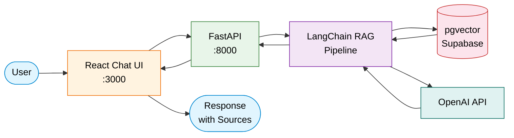

# RAG-Powered DevOps Knowledge Base

A production-ready RAG (Retrieval-Augmented Generation) chatbot that turns your DevOps documentation into an intelligent, searchable knowledge base. Ask questions in natural language and get accurate answers with source citations drawn directly from your ingested documents.

## Architecture



## Features

- **Document Ingestion** -- Upload and process PDF, DOCX, and Markdown files with automatic chunking and embedding
- **RAG Chat with Citations** -- Ask questions and receive answers grounded in your documentation, with clickable source references
- **Semantic Search** -- Find relevant documents using vector similarity powered by pgvector
- **Document Management** -- Browse, upload, and delete documents through an intuitive UI
- **Streaming Responses** -- Real-time token streaming for a responsive chat experience
- **Conversation History** -- Maintain context across multiple questions in a session

## Tech Stack

| Component       | Technology                        |
|-----------------|-----------------------------------|
| RAG Framework   | LangChain                         |
| Vector Store    | pgvector (via Supabase)            |
| Database        | Supabase (PostgreSQL)              |
| Backend API     | FastAPI + Uvicorn                  |
| Frontend        | React + TypeScript + Vite          |
| LLM             | OpenAI GPT-4o                      |
| Embeddings      | OpenAI text-embedding-3-small      |
| Infrastructure  | Terraform (GCP Cloud Run)          |
| CI/CD           | GitHub Actions                     |
| Containerization| Docker + Docker Compose            |

## Quick Start

### Prerequisites

- Docker and Docker Compose
- An OpenAI API key
- A Supabase project (free tier works)

### 1. Clone and configure

```bash
git clone https://github.com/your-org/devops-knowledge-base.git
cd devops-knowledge-base
cp .env.example .env
# Edit .env with your API keys
```

### 2. Start the services

```bash
docker compose up --build
```

- **Frontend:** http://localhost:3000
- **Backend API:** http://localhost:8000
- **API Docs:** http://localhost:8000/docs

## Supabase Setup

Run the following SQL in your Supabase SQL Editor to create the required table and enable pgvector:

```sql
-- Enable the pgvector extension
create extension if not exists vector;

-- Create the documents table for storing embeddings
create table if not exists documents (
    id bigserial primary key,
    content text not null,
    metadata jsonb default '{}'::jsonb,
    embedding vector(1536)
);

-- Create an index for fast similarity search
create index on documents
    using ivfflat (embedding vector_cosine_ops)
    with (lists = 100);

-- Create the document files tracking table
create table if not exists document_files (
    id uuid primary key default gen_random_uuid(),
    filename text not null,
    file_type text not null,
    file_size bigint not null,
    chunk_count integer default 0,
    status text default 'processing',
    created_at timestamptz default now(),
    updated_at timestamptz default now()
);

-- Row-level security (optional but recommended)
alter table documents enable row level security;
alter table document_files enable row level security;

create policy "Allow all access to documents"
    on documents for all
    using (true)
    with check (true);

create policy "Allow all access to document_files"
    on document_files for all
    using (true)
    with check (true);
```

## Project Structure

```
devops-knowledge-base/
├── .github/
│   └── workflows/
│       └── ci.yml                  # CI/CD pipeline (lint, build, deploy)
├── backend/
│   ├── app/
│   │   ├── api/                    # API route handlers
│   │   ├── core/                   # Configuration and settings
│   │   ├── models/                 # Pydantic models
│   │   └── services/               # Business logic (RAG, ingestion)
│   ├── Dockerfile
│   └── requirements.txt
├── frontend/
│   └── src/                        # React + TypeScript application
├── terraform/
│   ├── main.tf                     # Root module (composes all modules)
│   ├── variables.tf                # Input variables
│   ├── outputs.tf                  # Output values
│   ├── terraform.tfvars.example    # Example variable values
│   └── modules/
│       ├── apis/                   # GCP API enablement
│       ├── iam/                    # Service accounts and IAM bindings
│       ├── secret-manager/         # Secret Manager secrets
│       └── cloud-run/              # Cloud Run service deployment
├── docker-compose.yml              # Local development orchestration
├── .env.example                    # Environment variable template
├── .gitignore
└── README.md
```

## Infrastructure Deployment

### Using Terraform

```bash
cd terraform
cp terraform.tfvars.example terraform.tfvars
# Edit terraform.tfvars with your values

terraform init
terraform plan
terraform apply
```

This provisions:
- Required GCP APIs
- Service accounts with least-privilege IAM roles
- Secrets in Secret Manager
- Cloud Run services for backend and frontend

### CI/CD

The GitHub Actions workflow automatically:
1. **On PR:** Lints backend (ruff) and frontend (ESLint)
2. **On merge to main:** Builds Docker images, pushes to Artifact Registry, and deploys to Cloud Run

Required GitHub Secrets:
- `GCP_PROJECT_ID` -- Your GCP project ID
- `GCP_REGION` -- Deployment region (e.g., `us-central1`)
- `WIF_PROVIDER` -- Workload Identity Federation provider
- `WIF_SERVICE_ACCOUNT` -- Service account for CI/CD
- `BACKEND_URL` -- Backend Cloud Run URL (for frontend build)

## License

This project is licensed under the [MIT License](LICENSE).
